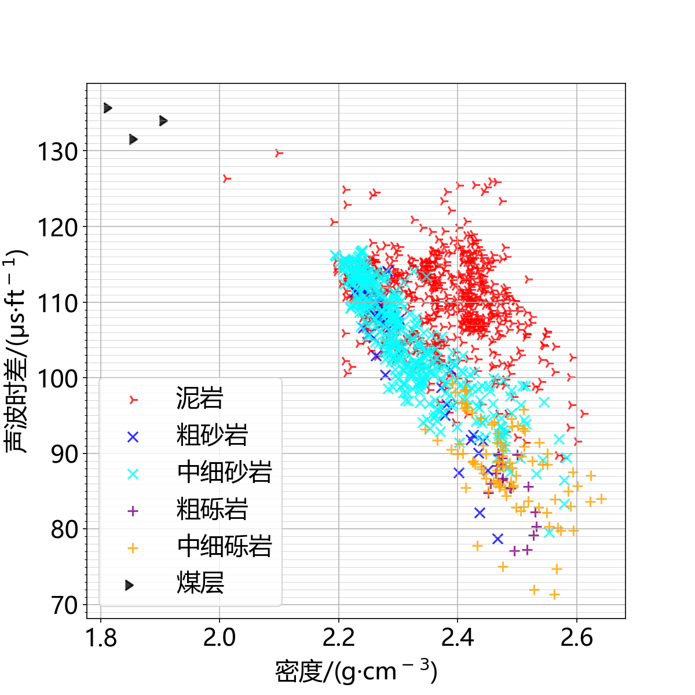
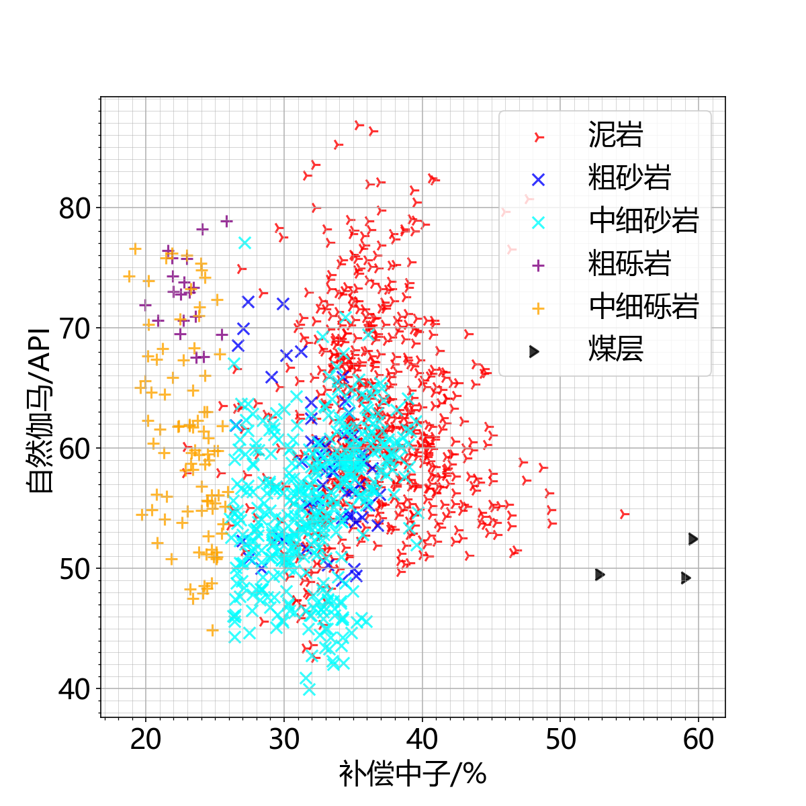
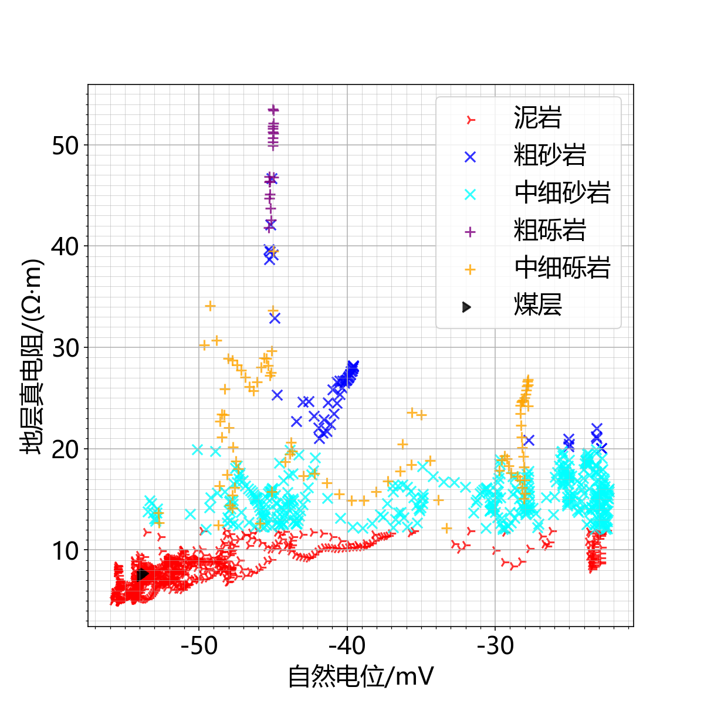
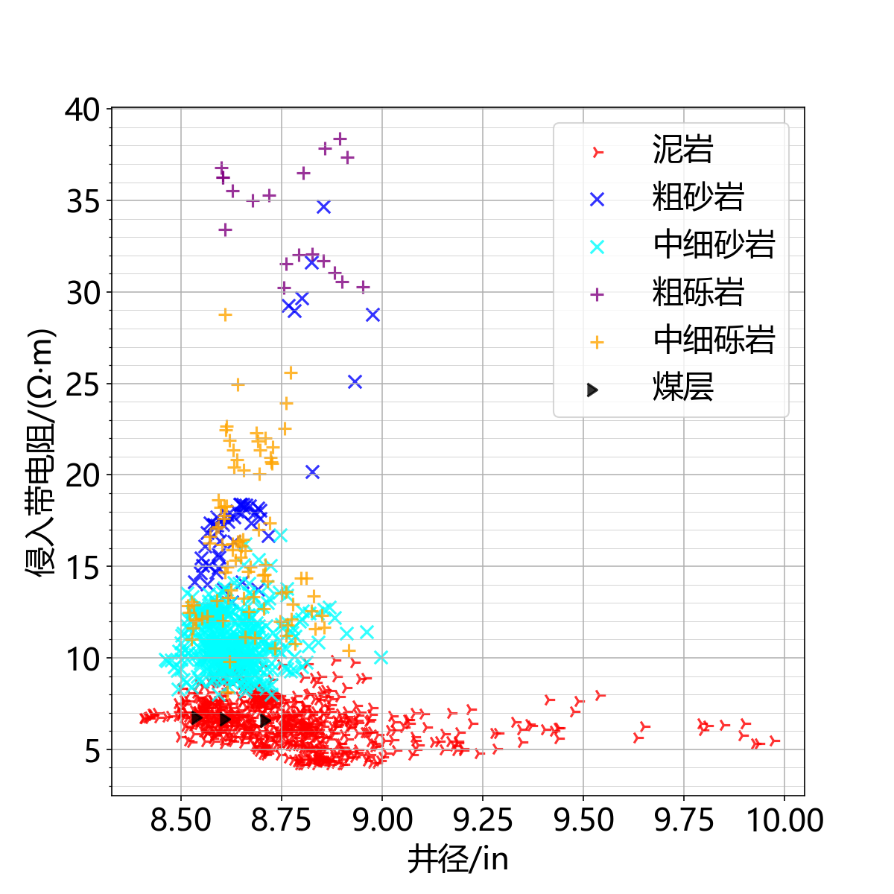
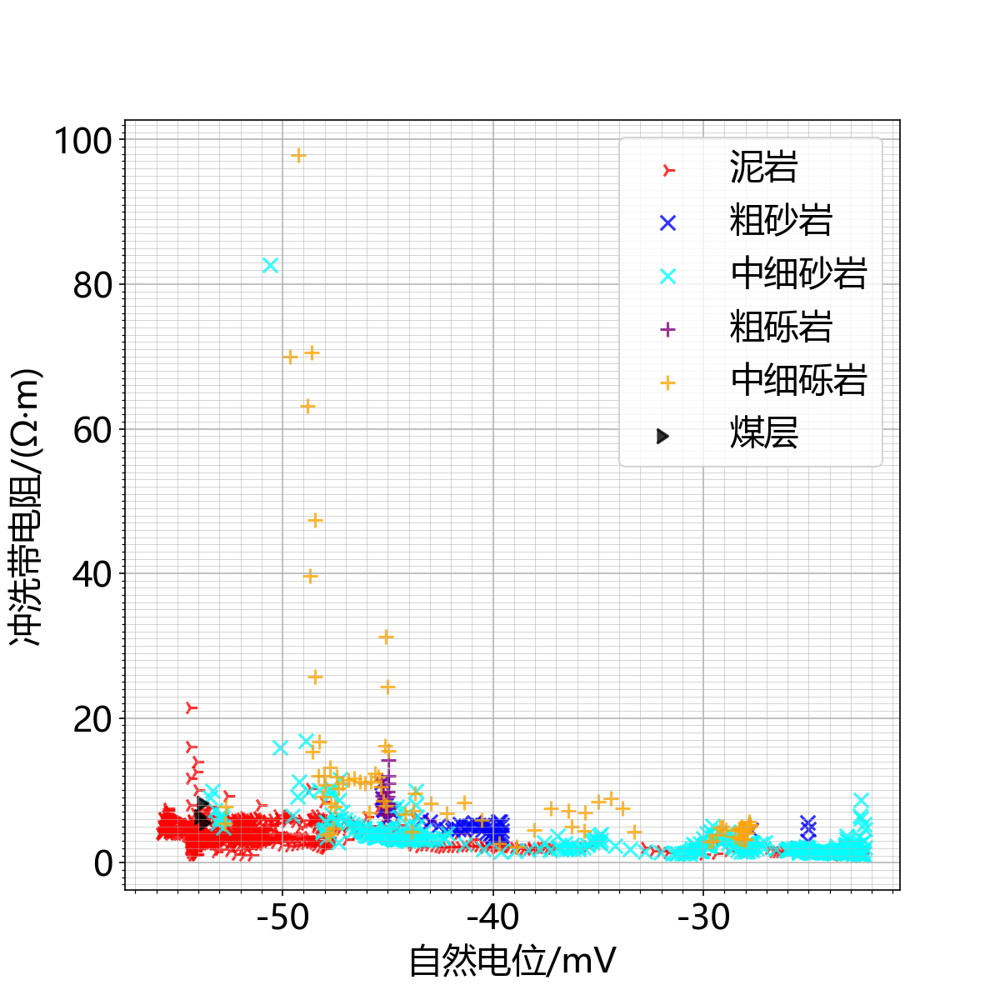
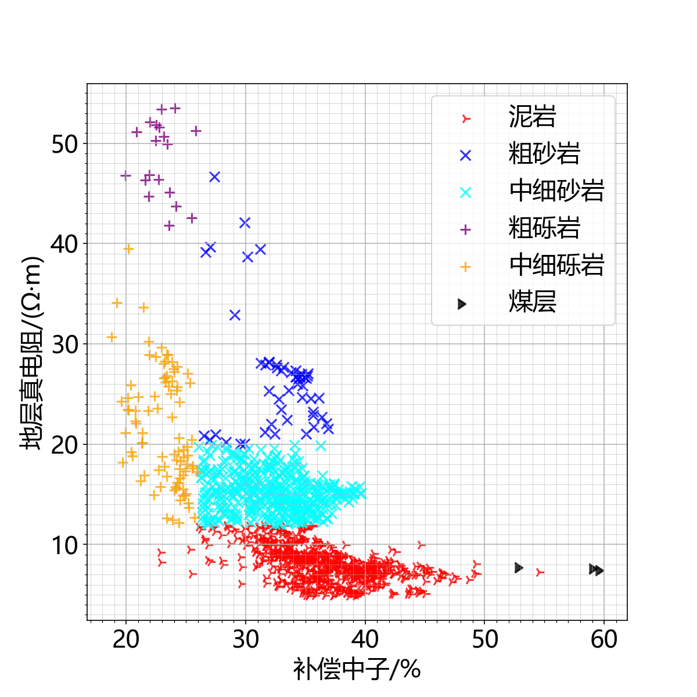
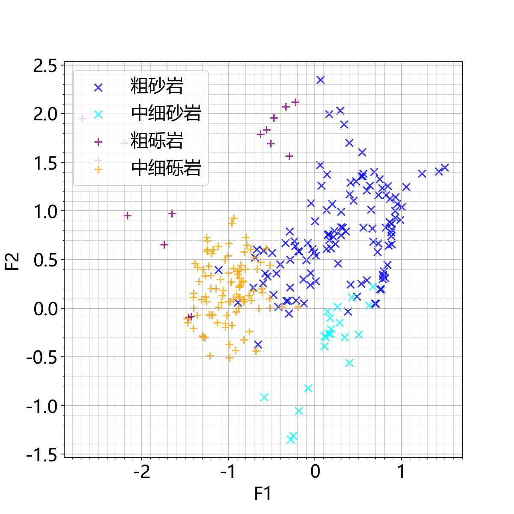
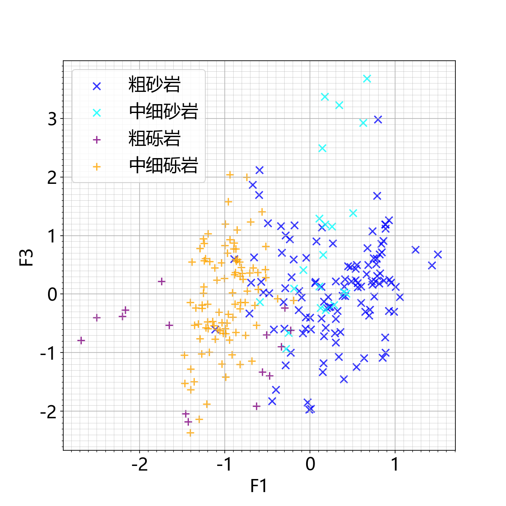
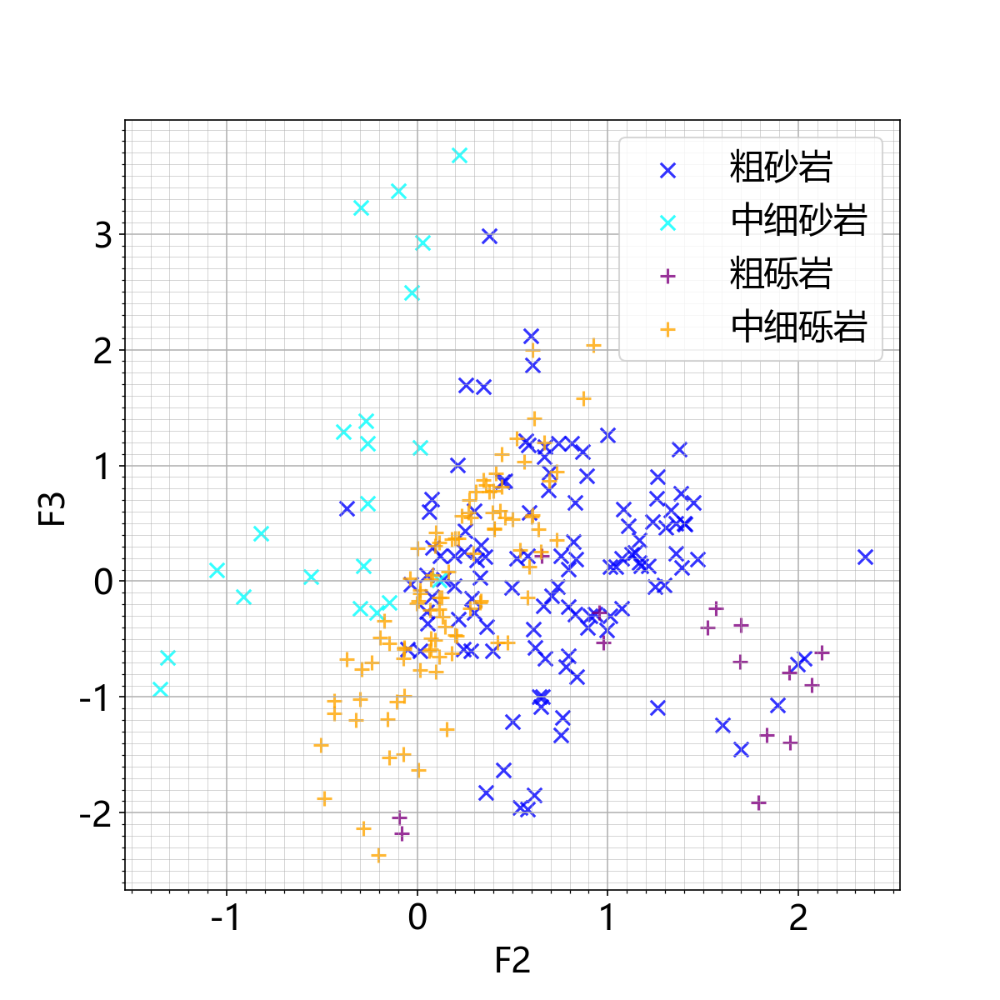
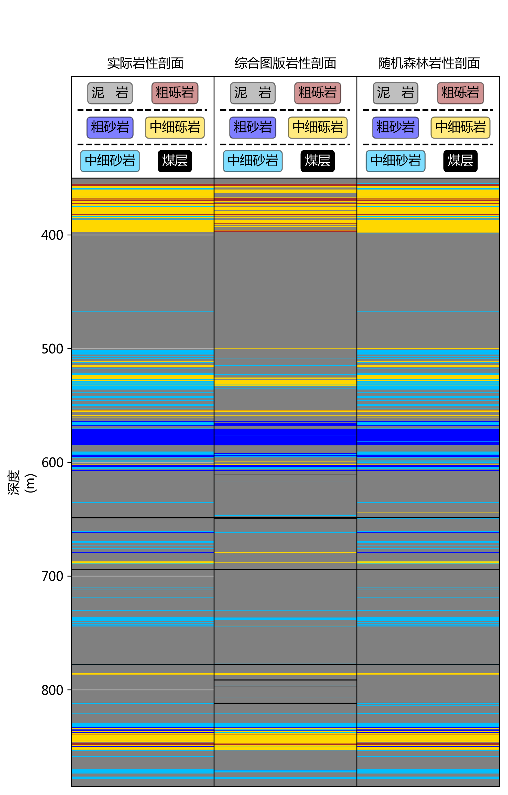

# **Intelligent lithologic identification**
## Running screenshots show
- **cplot2023**
  - 
  - 
- **pca2023**
  - 
- **results**
  - 
***
## Paper Support
- Original information: Intelligent lithologic identification of sandy conglomerate reservoirs in District No.7 of Karamay oilfield
- Recruitment Journal: Journal of Shenzhen University Science and Engineering 
- Original DOI: https://doi.org/10.3724/SP.J.1249.2023.03361
***
## Description of the project
The sandy conglomerate reservoirs in Karamay are characterized by diverse lithology and interlayers. The cost of the conventional coring methods is high, and the identification accuracy in non-coring section is low, which leads to difficulty in reservoir classification. Furthermore, the imbalanced samples will decrease the accuracy of identification. In order to achieve rapid and accurate identification of lithology, a lithology identification model is proposed based on the combination of k-means synthetic minority oversampling technique (KMSMOTE) and random forest to improve minority identification accuracy.
***
## Functions of the project
1. Automatic draw the conventional cross plot of logging data. Lithology identification with conventional cross plot.
2. Perform principal component analysis on logging data . Automatic draw the cross plot of the principal components. Lithology identification with the cross plot of the principal components.
3. Oversample on logging data with KMSMOTE. Lithology identification with random forest.
***
## The operating environment of the project
-	Python == 3.7.0
-	laspy == 2.0.1
-	pandas == 1.1.5
-	numpy == 1.21.6
-	matplotlib == 3.5.1
-	joblib == 1.1.0
-	time == 3.7.0
-	sklearn == 1.0.2
***
## How to use the project
#### 1、**Example.xls** is the training set. It is a part of logging data from a well in the Mahu area of Xinjiang, with 1242 lines of data.

#### 2、**Example test.xls** is the test set. It is a part of the well logging data from a well in the Mahu area of Xinjiang, with 360 lines of data.

#### 3、**The header of the .xls files**
|Abbreviated noun|Implication|
| ---- | ---- |
|Depth| Depth|
|GR |natural gamma-ray|
|SP| spontaneous potential|
|CALI |caliper |
|RT |true formation resistivity|
|RI| invaded zone resistivity|
|RXO |flushed zone formation resistivity|
|AC| acoustic |
|DEN |density |
|CNL| compensated neutron logging|
|R| lithology|

#### 4、**Cplot2023. py** is designed for Function 1. It can generate a conventional cross plot of logging data. Users can specify logging data intervals to identify different lithologies.

#### 5、**PCA2023. py** is designed for Function 2. It can generate a cross plot of principal components of logging data. Users can specify logging data intervals to identify different lithologies.

#### 6、**Rf2023. py** is designed for Function 3. It can oversample the minority lithology and identify lithology using random forest algorithm.